# AI Image Editor

**A local-first, multi-model image editing system that turns high-level editing intent into reproducible GPU workflows.**

The project exposes nine image generation and editing modes through one Python API, a FastAPI service, a Next.js studio, and a reproducible evaluation notebook. It orchestrates SAM2, OmniPaint, FLUX.1 Fill, FLUX.2 Klein, Real-ESRGAN, and optional GFPGAN behind a single `ImageProcessor` facade.

[Installation guide](GUIDE.md) · [Showcase notebook](notebooks/cv-showcase-all-modes.ipynb)

## See it in action

### Background replacement

The subject and composition are preserved while the scene is rebuilt from a natural-language instruction.

| Processed input | Generated result |
|:---:|:---:|
| 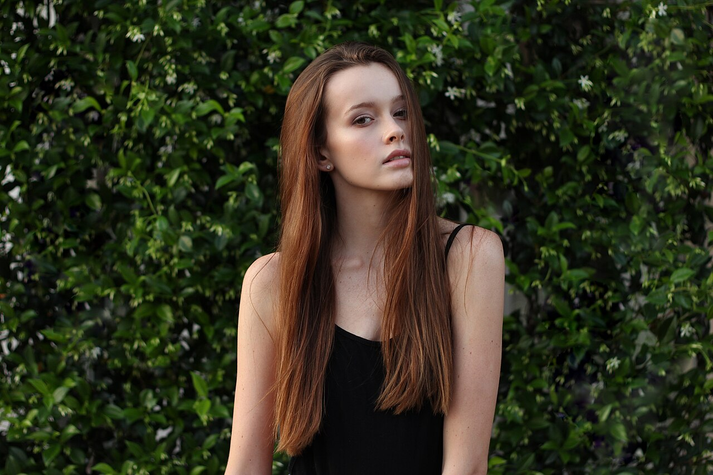 | 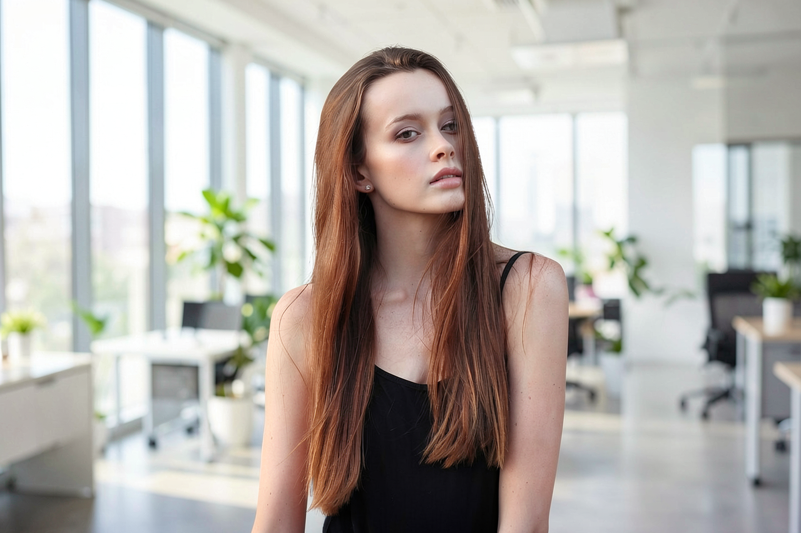 |

### Reference-guided object insertion

SAM2 extracts a subject from a reference image; OmniPaint inserts it into the requested target region.

| Target and placement | Reference and selection | Result |
|:---:|:---:|:---:|
| 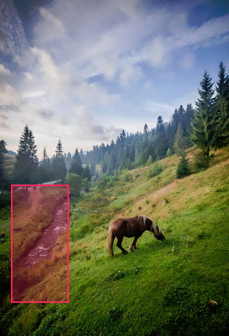 | 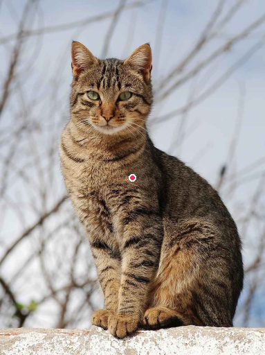 | 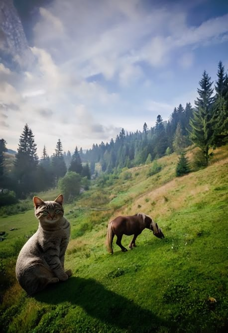 |

## Supported workflows

| # | Workflow | Input | Core backend |
|---:|---|---|---|
| 1 | Object removal | Image + point/box selection | SAM2 + OmniPaint |
| 2 | Object replacement | Image + selection + prompt | SAM2 + FLUX.1 Fill |
| 3 | Background replacement | Image + prompt | FLUX.2 Klein 4B |
| 4 | Add object by prompt | Image + prompt + optional placement | FLUX.2 Klein 4B |
| 5 | Add object by reference | Target + reference + placement | SAM2 + OmniPaint |
| 6 | Prompt-based editing | Image + instruction | FLUX.2 Klein 4B |
| 7 | Text-to-image | Prompt + dimensions | FLUX.2 Klein 4B |
| 8 | Outpainting | Image + margins + prompt | FLUX.1 Fill |
| 9 | Upscaling | Image + scale/options | Real-ESRGAN, optional GFPGAN |

## Results gallery

All examples below were produced by [`cv-showcase-all-modes.ipynb`](notebooks/cv-showcase-all-modes.ipynb). Selection markers are visualization overlays on the processed inputs, not pixels sent to the generation backend.

### 1. Object removal

| Processed input | SAM2 mask | Result |
|:---:|:---:|:---:|
| 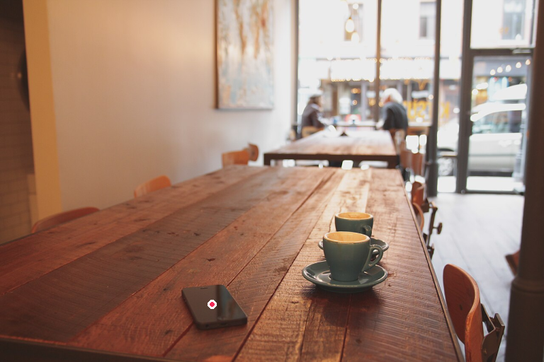 | 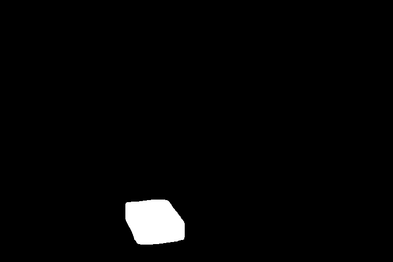 |  |

### 2. Object replacement

**Prompt:** “a golden retriever sitting in the same position”

| Processed input | SAM2 mask | Result |
|:---:|:---:|:---:|
|  |  | 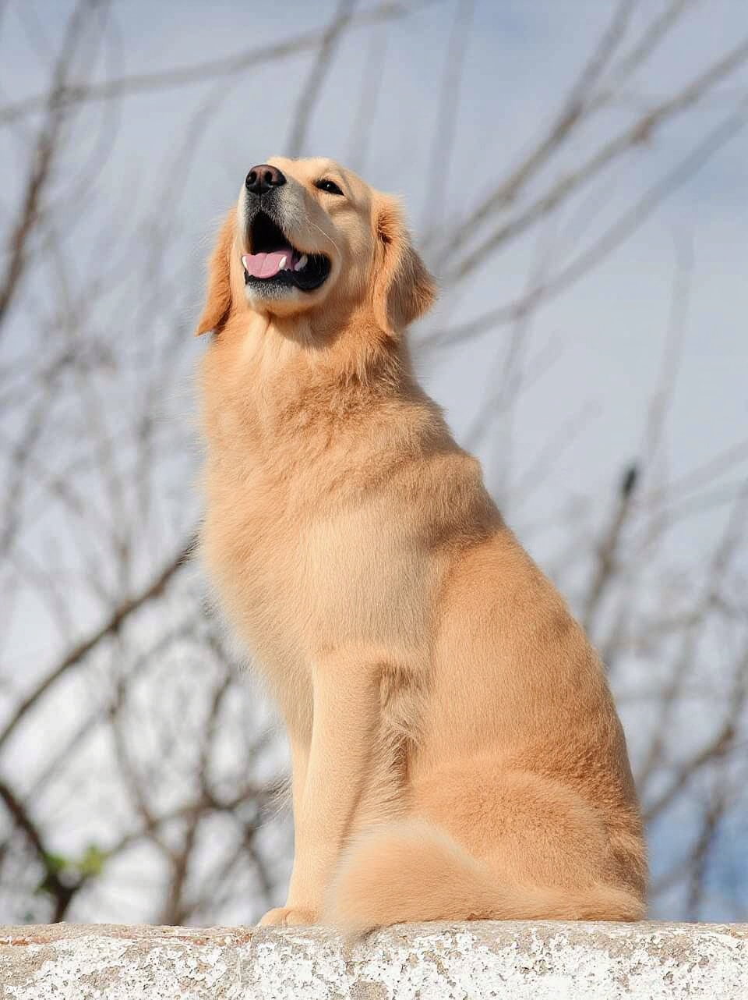 |

### 3. Background replacement

**Prompt:** “a bright modern creative office with soft window light and shallow depth of field”

| Processed input | Result |
|:---:|:---:|
|  |  |

### 4. Add object by prompt

**Prompt:** “a single colorful hot-air balloon floating naturally in the open sky above the field”

| Processed input | Result |
|:---:|:---:|
| 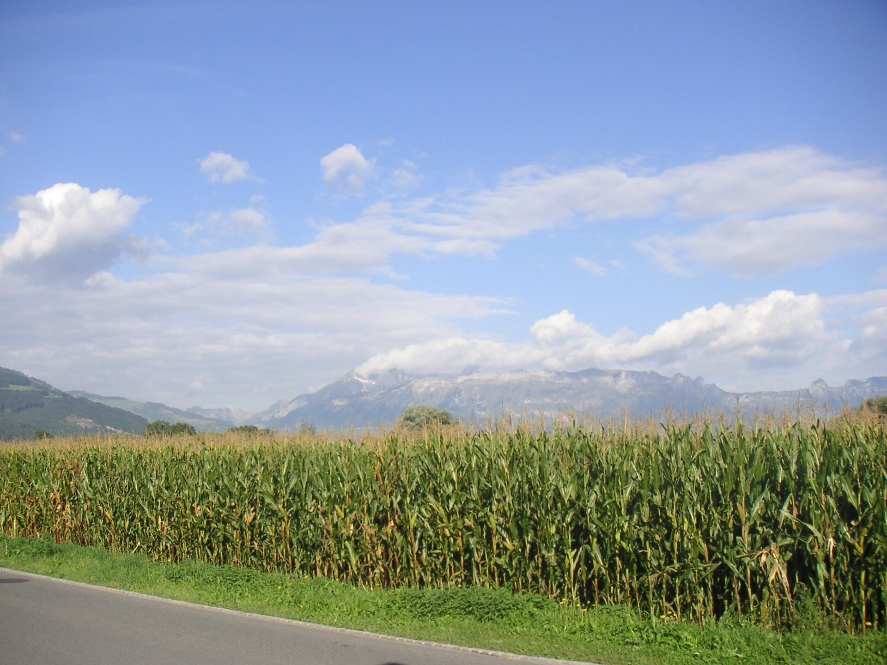 | 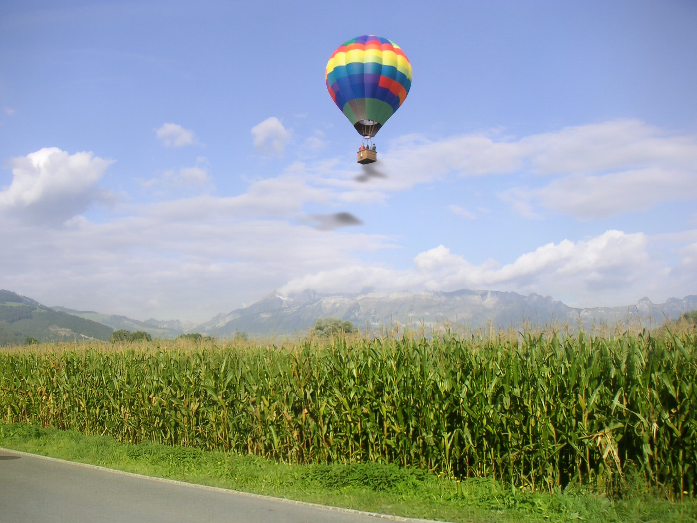 |

### 5. Add object by reference

| Target | Placement mask | Reference mask | Result |
|:---:|:---:|:---:|:---:|
|  | 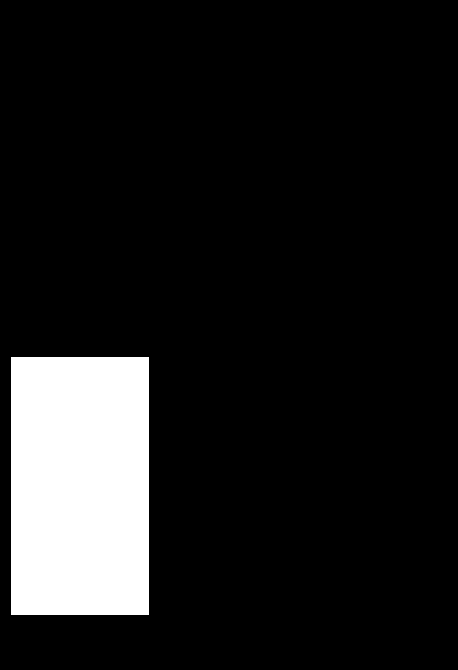 | 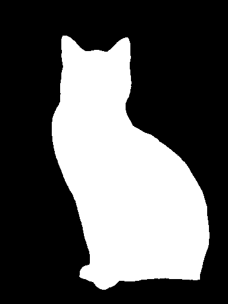 |  |

### 6. Prompt-based editing

**Prompt:** “Restore this archival photograph with natural modern colors, neutral white balance, and realistic contrast while preserving every person, object, and the original composition”

| Processed input | Result |
|:---:|:---:|
| 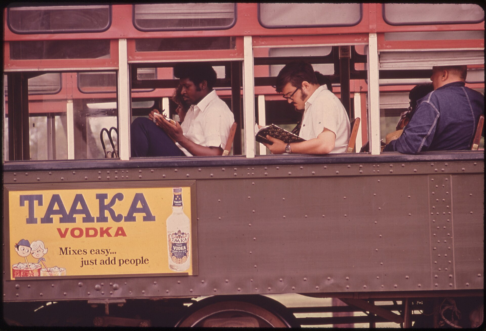 | 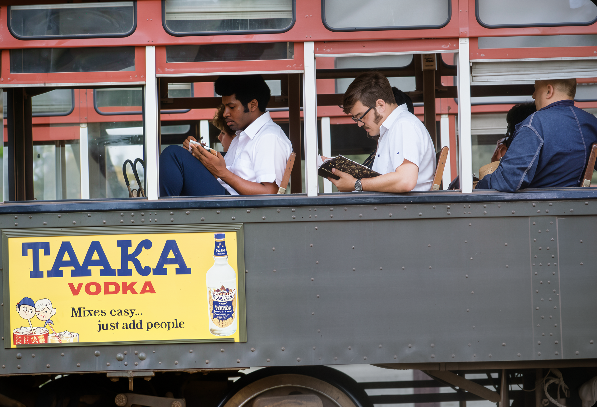 |

### 7. Text-to-image

**Prompt:** “A cinematic alpine lake at sunrise, mirror-like water, mist between mountains, realistic landscape photography, detailed natural lighting”

<p align="center">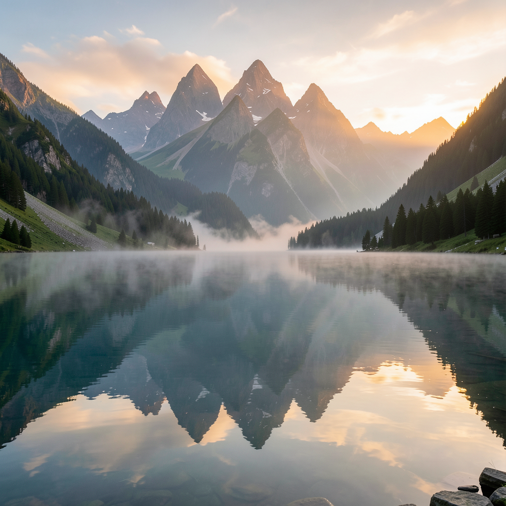</p>

### 8. Outpainting

Extend 128px left side and 128px right side

| Processed input | Extended result |
|:---:|:---:|
|  | 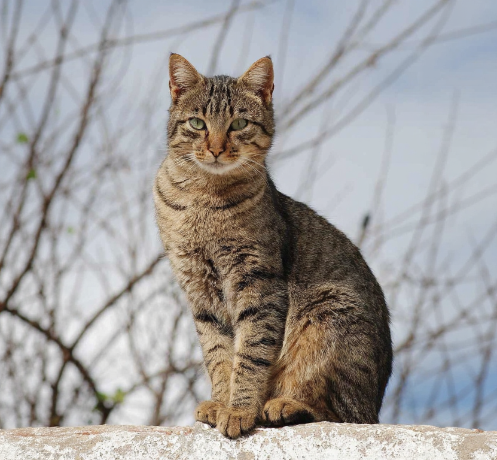 |

### 9. Upscaling

The example doubles the spatial resolution from **512 × 341** to **1024 × 682**.

| Processed input | 2× result |
|:---:|:---:|
| 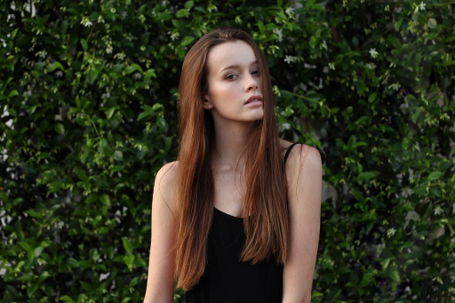 | 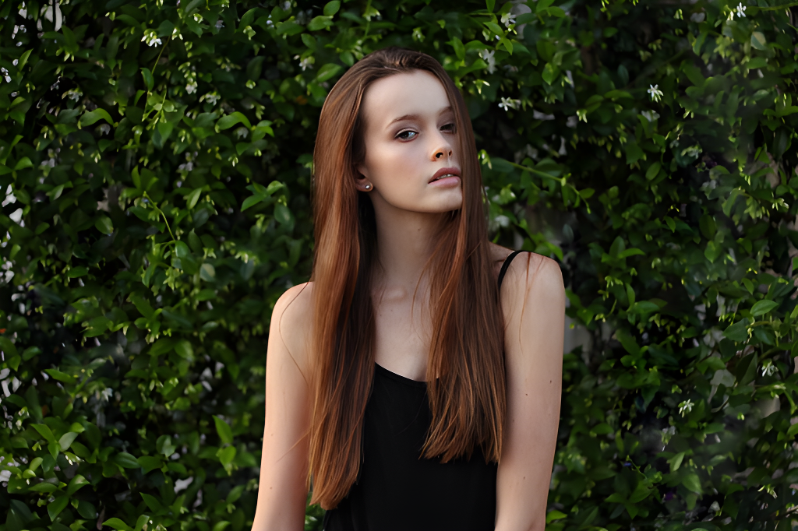 |

## Reproducible GPU profile

Each workflow records its processed image dimensions, wall-clock runtime, generation settings, backend, and CUDA peak memory. The values below come from one cold-start run per mode on an **NVIDIA L40S**; model loading is included, so they are reproducibility data rather than universal performance claims.

| Workflow | Backend | Steps | Processed/output size | Time | Peak VRAM allocated |
|---|---|---:|---:|---:|---:|
| Object removal | OmniPaint | 28 | 768 × 512 | 77.3 s | 25,480 MB |
| Object replacement | FLUX.1 Fill | default | 960 × 1282 | 86.4 s | 23,438 MB |
| Background replacement | FLUX.2 Klein | 4 | 1280 × 853 | 31.4 s | 9,164 MB |
| Add by prompt | FLUX.2 Klein | 4 | 1920 × 1440 | 15.7 s | 9,507 MB |
| Add by reference | OmniPaint | 28 | 458 × 670 | 71.8 s | 26,574 MB |
| Prompt edit | FLUX.2 Klein | 4 | 1920 × 1311 | 35.3 s | 9,386 MB |
| Text-to-image | FLUX.2 Klein | 4 | 1024 × 1024 | 11.8 s | 7,997 MB |
| Outpainting | FLUX.1 Fill | default | 831 × 768 | 608.2 s | 23,575 MB |
| Upscaling | Real-ESRGAN | — | 1024 × 682 | 0.63 s | 1,652 MB |

Runtime and memory vary with hardware, resolution, checkpoint cache state, and library versions. OmniPaint target images use a 768 px longest-side profile; other image workflows can preprocess up to 2048 px.

## How it is built

```text
Next.js studio
      │ JSON + base64 PNG
      ▼
FastAPI endpoints
      ▼
ImageProcessor facade
      ├── operations/   user-facing editing semantics
      ├── backends/     model-specific adapters
      └── ModelManager  lazy loading and GPU lifecycle
             ├── SAM2
             ├── OmniPaint
             ├── FLUX.1 Fill
             ├── FLUX.2 Klein 4B
             └── Real-ESRGAN / GFPGAN
```

The separation between operations and model adapters keeps the public API stable while allowing backends to be replaced or tested with lightweight fakes. A sequential memory policy can release the active model before loading the next one, while a resident policy keeps loaded backends available.

## Quick start

### Backend

```bash
conda env create -f environment.yml
conda activate imageinpaint
pip install -e . --no-deps
pip install git+https://github.com/facebookresearch/sam2.git
python scripts/install_omnipaint.py
python scripts/check_environment.py --require-cuda
```

Run the API with fake backends for UI development:

```bash
python scripts/run_api.py --fake
```

Or run real inference with the configured checkpoints:

```bash
python scripts/run_api.py --config configs/default.yaml
```

### Frontend

```bash
cd frontend
npm install
npm run dev
```

Open `http://localhost:3000/studio`. For environment variables, gated-model access, production commands, and platform notes, follow the [installation and usage guide](GUIDE.md).

## Verification

```bash
# CPU-safe contract and unit tests with fake backends
python -m pytest -q

# Real-GPU smoke tests
python scripts/smoke_test.py --mode segment
python scripts/smoke_test.py --mode all --reference assets/cat2.jpg
```

The FastAPI contract is tested across every endpoint without downloading model weights. Real inference can be validated one mode at a time with the sequential memory policy.

## Documentation

- [Installation and usage guide](GUIDE.md)
- [Architecture, API examples, and memory policy](TECHNICAL_REFERENCE.md)
- [Nine-mode showcase and profiling notebook](notebooks/cv-showcase-all-modes.ipynb)
- [Frontend-specific notes](frontend/README.md)
